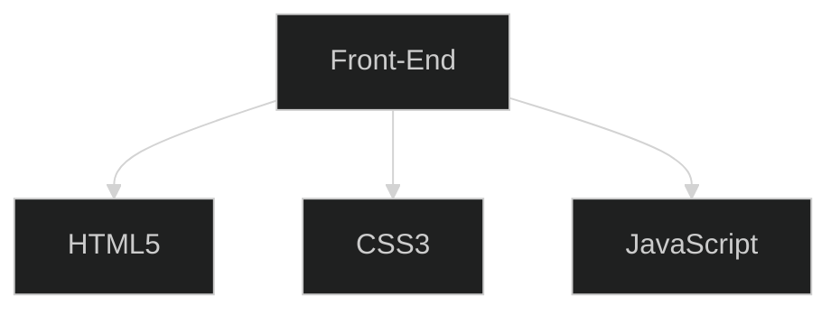
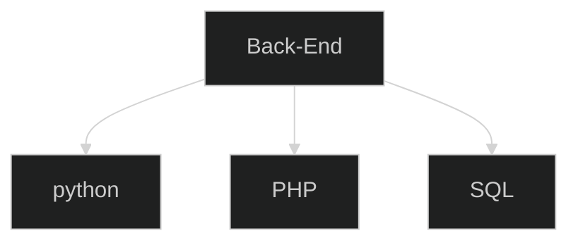

<!-----------------------TITULO------------------------->

 

<!----------------------STACK-------------------------->

  
   
  
  

 

<!----------------------REDES SOCIALES-------------------------->

      
    

<!----------------------TECNOLOGIAS FRONT END-------------------------->

<!----------------------TECNOLOGIAS BACK END-------------------------->

<!----------------------TECNOLOGIAS LOGOS-------------------------->

 
   
     
   
 
  
    
   
   
   
    

<!----------------------FINAL-------------------------->

   

